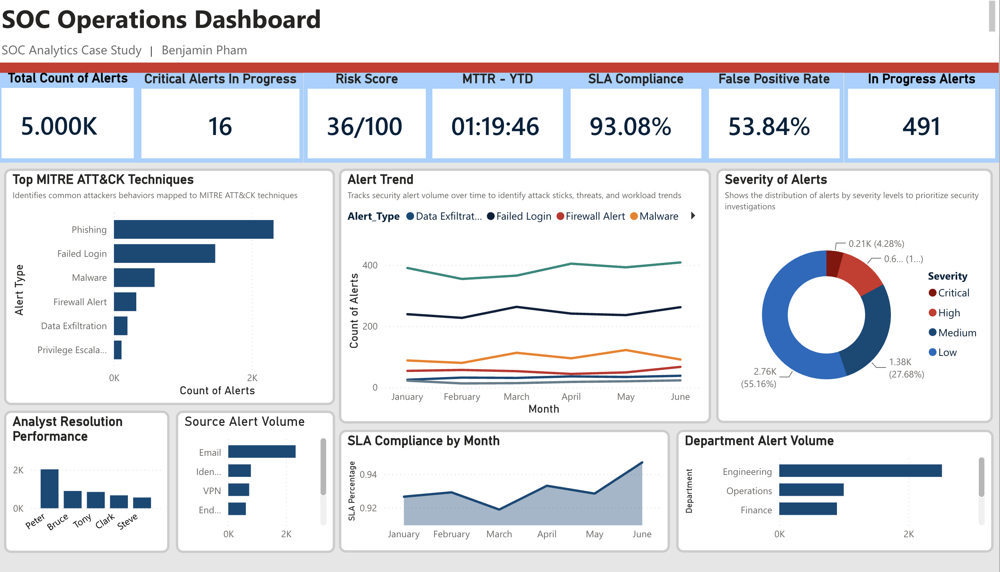

# SOC Analytics Case Study

## Business Problem

A finacial organization recievews thousand of security alerts alert month. Security Anaylst need better visbility into alert volume, response times, and false positives to prioritize high-risk indcidents. 

work in progres

## Objective

Goals of this project work in progress

## Assessment Scope 

Work in progress 

## Tools Used

work in progress

## Skills Demonstrated

work in progress

## View the live SOC Analytics Dashboard here: 

## Live Dashboard

[View the Interactive Power BI Dashboard](https://app.powerbi.com/reportEmbed?reportId=0b9f0f9b-b8d3-43a4-9fc9-57b843e1aaf9&autoAuth=true&ctid=92ebe562-ecd9-47fa-b107-065ebb49968e&actionBarEnabled=true)

## Dashboard Preview

