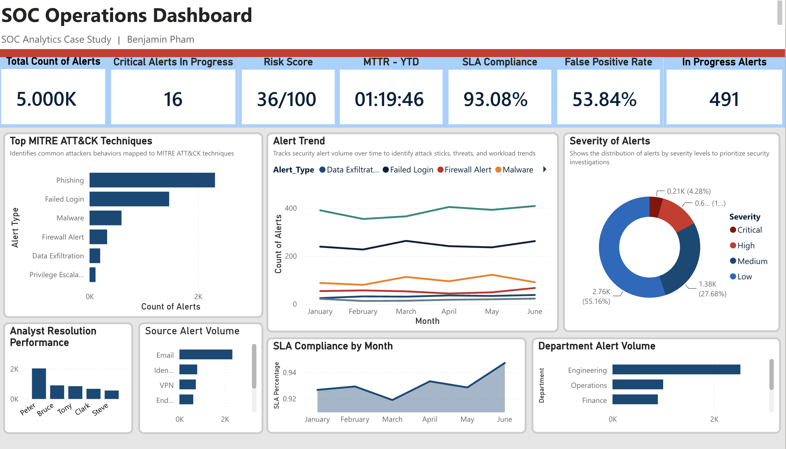

# SOC Operations Analytics Case Study

An end-to-end Security Operations Center (SOC) analytics solution that simulates enterprise security operations by generating, storing, analyzing, and visualizing security alert data. Built with Python, SQL, SQLite, and Power BI, this project transforms raw SOC data into executive-level dashboards that support operational decision-making, incident prioritization, and performance monitoring.

## Dashboard Preview

## View the live SOC Analytics Dashboard here: 
[Interactive Power BI Dashboard](https://app.powerbi.com/reportEmbed?reportId=0b9f0f9b-b8d3-43a4-9fc9-57b843e1aaf9&autoAuth=true&ctid=92ebe562-ecd9-47fa-b107-065ebb49968e&actionBarEnabled=true)

## Business Problem

Security Operations Centers (SOCs) generate thousands of security alerts every month from endpoint protection platforms, identity systems, email gateways, and network monitoring tools. Without centralized analytics, analysts struggle to identify operational trends, prioritize critical incidents, monitor response performance, and measure detection effectiveness.

Leadership also requires visibility into key operational metrics such as alert volume, Mean Time to Resolution (MTTR), Service Level Agreement (SLA) compliance, analyst workload, and false positive rates to continuously improve SOC performance.

## Objective

Develop an interactive SOC analytics dashboard that transforms raw security alert data into actionable operational intelligence.

Project objectives included:

+ Simulate an enterprise-scale SOC dataset containing 5,000 realistic security alerts
+ Design a relational SQLite database for structured security event storage
+ Perform SQL-based analysis to uncover operational trends and KPIs
+ Build interactive Power BI dashboards for executive reporting
+ Measure SOC performance through MTTR, SLA compliance, analyst productivity, and false positive analysis
+ Present findings using professional business intelligence visualizations

## Assessment Scope 

This assessment evaluates key operational areas within a Security Operations Center, including:

+ Security alert volume and distribution
+ Incident severity classification
+ Analyst workload and productivity
+ Mean Time to Resolution (MTTR)
+ SLA compliance performance
+ False positive detection rates
+ Department-level security trends
+ Threat source distribution
+ Risk score analysis
+ Operational KPI reporting

## Tools Used

work in progress

## Skills Demonstrated
# Coding Languages
+ Python
+ SQL
+ 
# Libraries
+ Pandas
+ NumPy
+ sqlite3

# Database
+ SQLite
# Business Intelligence
+ Power BI
+ Power Query
+ DAX
# Development Tools
+ Visual Studio Code
+ Git
+ GitHub

## Skills Demonstrated
+ Security Operations Center (SOC) Analytics
+ Cybersecurity Data Analysis
+ SQL Query Development
+ Database Design & Management
+ Python Data Processing & Automation
+ Interactive Dashboard Development
+ Power BI Data Modeling
+ DAX Measure Development
+ KPI & Executive Reporting
+ Incident Response Metrics
+ Mean Time to Resolution (MTTR) Analysis
+ SLA Compliance Reporting
+ Analyst Workload Analysis
+ False Positive Detection Analysis
+ Risk Score Analysis
+ Threat Trend Visualization
+ Business Intelligence Reporting
+ Data Visualization
+ Operational Performance Analysis

## Dashboard Highlights
+ Analysis of 5,000 simulated enterprise SOC security alerts
+ Executive KPI dashboard for operational performance
+ Alert severity and incident trend analysis
+ Analyst workload distribution and productivity metrics
+ Mean Time to Resolution (MTTR) monitoring
+ SLA compliance reporting
+ False positive detection analysis
+ Risk score visualization for incident prioritization
+ Department and threat source comparative analysis
+ Interactive filtering and drill-down reporting

## Key Findings
+ Identified alert trends across multiple security event categories
+ Measured analyst performance using operational KPIs
+ Evaluated SLA compliance to identify process improvement opportunities
+ Quantified false positive rates to support detection tuning
+ Developed executive dashboards that improve visibility into SOC operations and support data-driven decision-making

